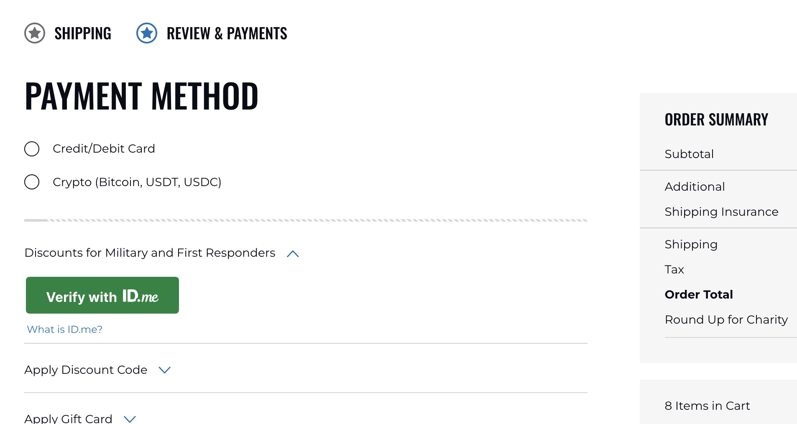
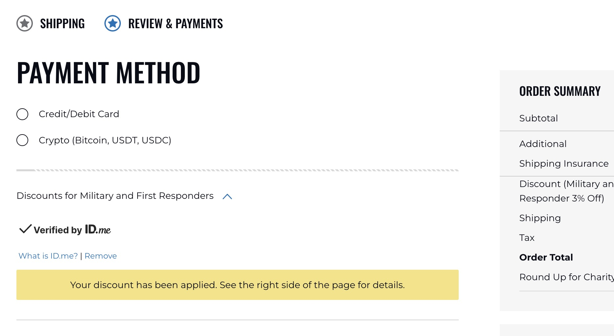

# ID.me Group Verification for Magento 2 - Military & First Responder Discounts

A Magento 2 extension that integrates [ID.me](https://www.id.me/) identity verification to offer exclusive discounts to military members, veterans, first responders, nurses, teachers, students, and other verified groups directly in your Magento 2 store's cart and checkout.

## Why ID.me for Magento 2?

Offering verified military and first responder discounts builds customer loyalty, drives conversions, and shows appreciation for those who serve. This extension makes it seamless by embedding the ID.me verification flow directly into your Magento 2 shopping cart and checkout -- no custom development required.

## Key Features

### Checkout Verification

Customers verify their eligibility directly on the checkout page. The "Verify with ID.me" button appears in a collapsible section alongside payment methods. Once verified, the discount is automatically applied to the order summary.

*The "Verify with ID.me" button on the Magento 2 checkout page, allowing customers to verify their military or first responder status before completing their order.*

### Automatic Discount Application

After successful verification, the discount is instantly applied and reflected in the order summary. A confirmation message lets the customer know the discount is active. Customers can also remove verification if needed.

*After verification, the discount is automatically applied and shown in the order summary (e.g., "Military and First Responder 3% Off").*

### Shopping Cart Integration

The ID.me verification button also appears in the shopping cart sidebar, so customers can verify and see their discount before even reaching the checkout page.

*The "Verify with ID.me" button in the shopping cart summary sidebar, enabling early discount verification.*

### Flexible Discount Rules via Cart Price Rules

Discounts are configured using Magento's native **Cart Price Rules** system. The extension adds two custom rule conditions:

- **ID.me Verification Group** -- Target specific groups (military, first responder, nurse, teacher, student, etc.)
- **ID.me Subgroup** -- Target specific subgroups (veteran, active service member, retiree, military spouse, firefighter, police officer, EMT, etc.)

This gives you full control over discount amounts, conditions, and which verified groups qualify -- all through the standard Magento admin interface.

### Supported Verification Groups

| Group | Example Subgroups |
|---|---|
| Military | Service member, veteran, retiree, military spouse, military family, surviving spouse |
| First Responders | Firefighter, police officer, EMT, 911 dispatcher |
| Nurse | Registered nurse, licensed practical nurse |
| Teacher | K-12 teacher, professor |
| Student | College student |
| Custom | Configure additional groups via the ID.me developer portal |

### Admin Dashboard & Reporting

A dedicated admin dashboard widget provides ID.me-specific sales metrics:

- Revenue from ID.me verified orders
- Average order value for verified customers
- Verification-to-purchase conversion rate
- Units per transaction

### Order-Level Verification Data

View ID.me verification details on each order in the Magento admin, including the customer's verified group, subgroups, and ID.me UUID for auditing and compliance.

### Secure OAuth 2.0 Integration

- HMAC-SHA256 signed state tokens with 10-minute expiry for CSRF protection
- Encrypted client secret storage using Magento's built-in encryptor
- Popup-based verification flow for a seamless customer experience
- No sensitive ID.me credentials stored in the browser

## Configuration Options

| Setting | Description |
|---|---|
| Enable/Disable | Toggle the module on or off |
| Client ID & Secret | Your ID.me OAuth application credentials |
| Verification Scopes | Comma-separated list of groups to verify (e.g., `military,responder,nurse`) |
| Policies Configuration | JSON configuration for groups and subgroups (auto-fetched from ID.me API if empty) |
| About Text | Custom HTML for the "What is ID.me?" link |
| Discount Messaging | Customizable messages shown after verification (separate desktop and mobile versions) |
| Section Expanded by Default | Whether the ID.me section is expanded by default on checkout |

## Requirements

- Magento 2.3 or later (including Magento 2.4.x)
- PHP 7.4+ / PHP 8.x
- League OAuth2 Client v2.7+

## Get the Extension

This extension is available through Kraken Commerce. **[Contact us](https://www.krakencommerce.com/contact/)** to get a copy of the ID.me Group Verification extension for your Magento 2 store.

## About Kraken Commerce

[Kraken Commerce](https://www.krakencommerce.com/contact/) specializes in Magento 2 development and extensions. We build high-quality ecommerce solutions that help merchants grow their business.

## License

This is a commercial extension. All rights reserved.
